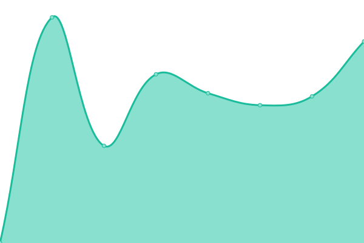

# [📈 Live Status](https://status.adsb.lol): <!--live status--> **🟩 All systems operational**

This repository contains the open-source uptime monitor and status page for [ADSB.lol](https://adsb.lol), powered by [Upptime](https://github.com/upptime/upptime).

With [Upptime](https://upptime.js.org), you can get your own unlimited and free uptime monitor and status page, powered entirely by a GitHub repository. We use [Issues](https://github.com/adsblol/status/issues) as incident reports, [Actions](https://github.com/adsblol/status/actions) as uptime monitors, and [Pages](https://status.adsb.lol) for the status page.

<!--start: status pages-->
<!-- This summary is generated by Upptime (https://github.com/upptime/upptime) -->
<!-- Do not edit this manually, your changes will be overwritten -->
<!-- prettier-ignore -->
| URL | Status | History | Response Time | Uptime |
| --- | ------ | ------- | ------------- | ------ |
|  [adsb.lol](https://adsb.lol) | 🟩 Up | [adsb-lol.yml](https://github.com/adsblol/status/commits/HEAD/history/adsb-lol.yml) | 

 722ms
     
 | 

<a href="https://status.adsb.lol/history/adsb-lol">100.00%</a>
    

|  [globe.adsb.lol](https://globe.adsb.lol) | 🟩 Up | [globe-adsb-lol.yml](https://github.com/adsblol/status/commits/HEAD/history/globe-adsb-lol.yml) | 

 628ms
     
 | 

<a href="https://status.adsb.lol/history/globe-adsb-lol">100.00%</a>
    

|  [api.adsb.lol](https://api.adsb.lol/metrics) | 🟩 Up | [api-adsb-lol.yml](https://github.com/adsblol/status/commits/HEAD/history/api-adsb-lol.yml) | 

 441ms
     
 | 

<a href="https://status.adsb.lol/history/api-adsb-lol">100.00%</a>
    

|  [feed.adsb.lol:1337](feed.adsb.lol) | 🟩 Up | [feed-adsb-lol-1337.yml](https://github.com/adsblol/status/commits/HEAD/history/feed-adsb-lol-1337.yml) | 

 230ms
     
 | 

<a href="https://status.adsb.lol/history/feed-adsb-lol-1337">100.00%</a>
    

|  [feed.adsb.lol:1338](feed.adsb.lol) | 🟩 Up | [feed-adsb-lol-1338.yml](https://github.com/adsblol/status/commits/HEAD/history/feed-adsb-lol-1338.yml) | 

 180ms
     
 | 

<a href="https://status.adsb.lol/history/feed-adsb-lol-1338">100.00%</a>
    

|  [feed.adsb.lol:30004](feed.adsb.lol) | 🟩 Up | [feed-adsb-lol-30004.yml](https://github.com/adsblol/status/commits/HEAD/history/feed-adsb-lol-30004.yml) | 

 144ms
     
 | 

<a href="https://status.adsb.lol/history/feed-adsb-lol-30004">100.00%</a>
    

|  [feed.adsb.lol:30005](feed.adsb.lol) | 🟩 Up | [feed-adsb-lol-30005.yml](https://github.com/adsblol/status/commits/HEAD/history/feed-adsb-lol-30005.yml) | 

 162ms
     
 | 

<a href="https://status.adsb.lol/history/feed-adsb-lol-30005">100.00%</a>
    

|  [feed.adsb.lol:31090](feed.adsb.lol) | 🟩 Up | [feed-adsb-lol-31090.yml](https://github.com/adsblol/status/commits/HEAD/history/feed-adsb-lol-31090.yml) | 

 141ms
     
 | 

<a href="https://status.adsb.lol/history/feed-adsb-lol-31090">100.00%</a>
    

|  [grafana.adsb.lol](https://grafana.adsb.lol) | 🟩 Up | [grafana-adsb-lol.yml](https://github.com/adsblol/status/commits/HEAD/history/grafana-adsb-lol.yml) | 

 709ms
     
 | 

<a href="https://status.adsb.lol/history/grafana-adsb-lol">100.00%</a>
    

|  [api.adsb.lol/api/0/me](https://api.adsb.lol/api/0/me) | 🟩 Up | [api-adsb-lol-api-0-me.yml](https://github.com/adsblol/status/commits/HEAD/history/api-adsb-lol-api-0-me.yml) | 

 163ms
     
 | 

<a href="https://status.adsb.lol/history/api-adsb-lol-api-0-me">100.00%</a>
    

<!--end: status pages-->

[**Visit our status website →**](https://status.adsb.lol)

## 📄 License

- Powered by: [Upptime](https://github.com/upptime/upptime)
- Code: [MIT](./LICENSE) © [ADSB.lol](https://adsb.lol)
- Data in the `./history` directory: [Open Database License](https://opendatacommons.org/licenses/odbl/1-0/)
